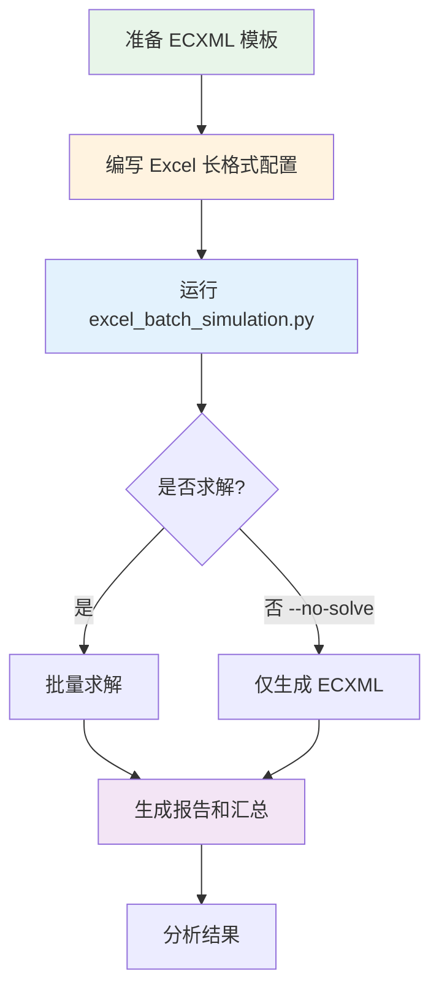

# Excel 配置使用指南

本文档说明如何编写 Excel 配置文件，配合 `excel_batch_simulation.py` 进行批量仿真。

---

## 支持的文件格式

工具支持以下三种 FloTHERM 文件格式：

| 格式 | 扩展名 | 说明 | 包含网格 |
|------|--------|------|----------|
| **ECXML** | `.ecxml` | JEDEC JEP181 标准，中性格式 | ❌ 不包含 |
| **PDML** | `.pdml` | FloTHERM 原生格式 | ✅ 包含 |
| **FloXML** | `.floxml` | FloTHERM XML 格式 | ✅ 包含 |

### 格式选择建议

- **使用 PDML/FloXML**：如果需要完整的模型定义（包括网格设置），推荐使用这两种格式
- **使用 ECXML**：如果只需要热模型参数交换（供应商到最终用户），使用 ECXML

---

## 快速开始

### 1. 准备模板文件

首先需要一个包含器件和边界条件的模板文件（`.ecxml`、`.pdml` 或 `.floxml`）。模板中的参数将被 Excel 配置覆盖。

### 2. 编写 Excel 配置文件

创建一个 Excel 文件（.xlsx），使用**长格式**（每个参数一行）：

| config_name | name     | attribute         | value |
|-------------|----------|-------------------|-------|
| case1       | CPU      | powerDissipation  | 10    |
| case1       | GPU      | powerDissipation  | 5     |
| case1       | Heatsink | Material.density  | 8900  |
| case1       | Ambient  | temperature       | 25    |
| case2       | CPU      | powerDissipation  | 15    |
| case2       | GPU      | powerDissipation  | 8     |
| case2       | Heatsink | Material.density  | 8500  |
| case2       | Ambient  | temperature       | 35    |

### 3. 运行批量仿真

```bash
# 使用 ECXML 模板
python excel_batch_simulation.py template.ecxml config.xlsx -o ./output

# 使用 PDML 模板（包含网格信息）
python excel_batch_simulation.py template.pdml config.xlsx -o ./output

# 使用 FloXML 模板
python excel_batch_simulation.py template.floxml config.xlsx -o ./output
```

---

## Excel 格式详解

### 必要列

| 列名 | 说明 |
|-----|------|
| `config_name` | 配置名称，同一配置的多行会被合并处理 |
| `name` | 元素名称，用于在 `materials.material` 中查找 `name={name}` 的元素 |
| `attribute` | 要修改的属性路径，支持点分隔和 @ 属性 |
| `value` | 要设置的值 |

### 路径组合逻辑

```
materials.material[name={name}].{attribute} = value
```

例如：
- `name=Copper`, `attribute=density` → `materials.material[name=Copper].density`
- `name=Heatsink`, `attribute=Material.conductivity` → `materials.material[name=Heatsink].Material.conductivity`

---

## attribute 格式支持

### 1. 简单属性

直接写属性名：

| name | attribute | value |
|------|-----------|-------|
| Copper | density | 8900 |
| Copper | conductivity | 400 |

### 2. 多层路径（点分隔）

用 `.` 访问子元素：

| name | attribute | value |
|------|-----------|-------|
| Heatsink | Material.density | 8900 |
| Heatsink | Material.conductivity | 400 |
| PCB | Size.width | 0.1 |

### 3. 属性访问（@符号）

用 `@` 访问 XML 属性：

| name | attribute | value |
|------|-----------|-------|
| PCB | Size@width | 0.1 |
| PCB | Size@height | 0.002 |
| Fan | @flowRate | 0.05 |

### 4. 组合格式

可以组合使用：

| name | attribute | value |
|------|-----------|-------|
| Heatsink | Material.Size@width | 0.05 |

---

## 配置示例

### 示例 1：功耗测试

测试不同功耗水平下的热性能：

| config_name | name | attribute | value |
|-------------|------|-----------|-------|
| idle | CPU | powerDissipation | 5 |
| idle | GPU | powerDissipation | 2 |
| normal | CPU | powerDissipation | 15 |
| normal | GPU | powerDissipation | 10 |
| heavy | CPU | powerDissipation | 30 |
| heavy | GPU | powerDissipation | 20 |

### 示例 2：材料扫描测试

测试不同材料的热性能：

| config_name | name | attribute | value |
|-------------|------|-----------|-------|
| aluminum | Heatsink | Material.density | 2700 |
| aluminum | Heatsink | Material.conductivity | 200 |
| copper | Heatsink | Material.density | 8900 |
| copper | Heatsink | Material.conductivity | 400 |

### 示例 3：温度扫描测试

测试不同环境温度下的器件温度：

| config_name | name | attribute | value |
|-------------|------|-----------|-------|
| temp_0C | Ambient | temperature | 0 |
| temp_0C | CPU | powerDissipation | 20 |
| temp_25C | Ambient | temperature | 25 |
| temp_25C | CPU | powerDissipation | 20 |
| temp_40C | Ambient | temperature | 40 |
| temp_40C | CPU | powerDissipation | 20 |

### 示例 4：完整配置

一个包含多个参数的完整配置：

| config_name | name | attribute | value |
|-------------|------|-----------|-------|
| case1 | CPU | powerDissipation | 10 |
| case1 | GPU | powerDissipation | 5 |
| case1 | DDR | powerDissipation | 3 |
| case1 | Heatsink | Material.density | 8900 |
| case1 | Heatsink | Material.conductivity | 400 |
| case1 | PCB | Size@width | 0.1 |
| case1 | PCB | Size@depth | 0.15 |
| case1 | Ambient | temperature | 25 |

---

## 命令行参数

```bash
python excel_batch_simulation.py <模板文件> <Excel文件> -o <输出目录> [选项]
```

### 必需参数

| 参数 | 说明 |
|-----|------|
| `template` | 模板文件路径（支持 .ecxml, .pdml, .floxml） |
| `excel` | Excel 配置文件路径 |
| `-o, --output` | 输出文件夹路径 |

### 可选参数

| 参数 | 说明 |
|-----|------|
| `--sheet <名称>` | 指定 Excel Sheet 名称（默认使用第一个） |
| `--flotherm <路径>` | 指定 FloTHERM 可执行文件路径 |
| `--no-solve` | 仅生成 ECXML 文件，不求解 |
| `--dry-run` | 仅预览配置，不执行任何操作 |

### 使用示例

```bash
# 使用 ECXML 模板
python excel_batch_simulation.py model.ecxml config.xlsx -o ./results

# 使用 PDML 模板（包含网格信息，推荐）
python excel_batch_simulation.py model.pdml config.xlsx -o ./results

# 使用 FloXML 模板
python excel_batch_simulation.py model.floxml config.xlsx -o ./results

# 指定 FloTHERM 路径
python excel_batch_simulation.py model.pdml config.xlsx -o ./results \
  --flotherm "C:\Program Files\Siemens\SimcenterFlotherm\2020.2\bin\flotherm.exe"

# 使用指定 Sheet
python excel_batch_simulation.py model.pdml config.xlsx -o ./results --sheet "测试配置"

# 仅生成模型文件（用于检查或手动求解）
python excel_batch_simulation.py model.pdml config.xlsx -o ./results --no-solve

# 预览配置（检查 Excel 是否正确）
python excel_batch_simulation.py model.pdml config.xlsx -o ./results --dry-run
```

---

## 输出文件

运行后会在输出目录生成带时间戳的文件夹：

```
output/
└── batch_20260312_100000/
    ├── case1.pdml           # 修改后的模型文件（保持模板格式）
    ├── case1.pack           # 求解结果（如果求解）
    ├── case1_report.html    # HTML 报告（如果求解）
    ├── case2.pdml
    ├── case2.pack
    ├── case2_report.html
    ├── ...
    ├── batch_report.txt     # 批量处理报告
    └── summary.xlsx         # 汇总表格（含配置和状态）
```

> **注意**：输出文件格式与输入模板保持一致。如果使用 `.pdml` 模板，输出也是 `.pdml`。

---

## 常见问题

### Q1: 提示"未找到元素"

**原因**：Excel 中的 `name` 与 ECXML 中的元素名不匹配。

**解决**：
1. 使用 `ecxml_editor.py --info template.ecxml` 查看模板中的元素名称
2. 确保 Excel 中的 `name` 与元素名完全一致

### Q2: 如何查看模板中有哪些可配置参数？

```bash
python ecxml_editor.py template.ecxml --analyze
```

这会显示模板中的所有器件、功耗字段和边界条件。

### Q3: 可以修改其他参数吗（如尺寸、位置）？

可以！使用 `attribute` 列指定路径：

| 需求 | attribute 写法 |
|-----|---------------|
| 材料密度 | `Material.density` |
| 尺寸宽度（属性） | `Size@width` |
| 位置坐标 | `Position@x` |

---

## 格式差异说明

### ECXML vs PDML/FloXML

| 特性 | ECXML | PDML/FloXML |
|-----|-------|-------------|
| **标准** | JEDEC JEP181 | FloTHERM 原生 |
| **网格信息** | ❌ 不包含 | ✅ 包含 |
| **求解控制** | ❌ 不包含 | ✅ 包含 |
| **材料库** | 基础 | 完整 |
| **用途** | 供应商到最终用户的热模型交换 | 完整的仿真模型 |

### 为什么推荐使用 PDML/FloXML？

1. **包含网格设置**：ECXML 是中性格式，不包含网格划分信息
2. **完整求解控制**：包含求解器设置、收敛标准等
3. **更好的兼容性**：FloTHERM 直接处理原生格式

---

## 工作流程图



---

## 依赖安装

```bash
# 使用 openpyxl（推荐，轻量）
pip install openpyxl

# 或使用 pandas
pip install pandas
```
