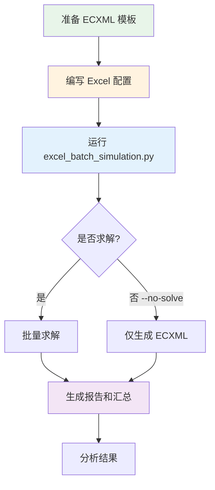

# Excel 配置使用指南

本文档说明如何编写 Excel 配置文件，配合 `excel_batch_simulation.py` 进行批量仿真。

---

## 快速开始

### 1. 准备 ECXML 模板

首先需要一个包含器件和边界条件的 ECXML 模板文件。模板中的参数将被 Excel 配置覆盖。

### 2. 编写 Excel 配置文件

创建一个 Excel 文件（.xlsx），格式如下：

| config_name | U1_CPU | U2_GPU | U3_DDR | Ambient |
|-------------|--------|--------|--------|---------|
| case1       | 10     | 5      | 3      | 25      |
| case2       | 15     | 8      | 5      | 35      |
| case3       | 20     | 10     | 8      | 40      |

### 3. 运行批量仿真

```bash
python excel_batch_simulation.py template.ecxml config.xlsx -o ./output
```

---

## Excel 格式详解

### 必须遵循的规则

1. **第一列必须是 `config_name`**
   - 这是配置的名称，用于命名输出文件
   - 例如：`case1`, `case2`, `high_power`, `low_temp` 等

2. **列名必须与 ECXML 中的名称匹配**
   - 器件名：对应 ECXML 中 `Component` 的 `name` 属性
   - 边界条件名：对应 ECXML 中 `BoundaryCondition` 的 `name` 属性

3. **数值自动识别类型**
   - 如果列名匹配到器件 → 设置功耗（W）
   - 如果列名匹配到边界条件 → 设置温度（°C）

### 参数类型说明

| 参数类型 | Excel 列名 | ECXML 对应 | 单位 |
|---------|-----------|-----------|------|
| 器件功耗 | 器件的 `name` 属性 | `<Component name="xxx">` | W（瓦特） |
| 环境温度 | 边界条件的 `name` 属性 | `<BoundaryCondition name="xxx">` | °C（摄氏度） |

### 路径格式（高级）

除了简单的名称匹配，还支持以下路径格式：

| Excel 列名格式 | 说明 | 示例 |
|---------------|------|------|
| `ComponentName` | 自动识别（功耗/温度） | `CPU` → 设置功耗 |
| `Name.child` | 子元素的文本值 | `CPU.powerDissipation` |
| `Name/child/grandchild` | 多层路径 | `Heatsink.Material.density` |
| `Name@attr` | 元素的属性 | `Fan@flowRate` |
| `Name.child@attr` | 子元素的属性 | `PCB.Size@width` |

**示例：修改材料属性**

假设 ECXML 结构：
```xml
<Component name="Heatsink">
  <Material name="Aluminum">
    <density>2700</density>
    <specificHeat>900</specificHeat>
  </Material>
</Component>
```

Excel 配置：
| config_name | Heatsink.Material.density | Heatsink.Material.specificHeat |
|-------------|---------------------------|-------------------------------|
| aluminum    | 2700                      | 900                           |
| copper      | 8900                      | 385                           |

**示例：修改尺寸属性**

假设 ECXML 结构：
```xml
<Component name="PCB">
  <Size width="0.1" height="0.002" depth="0.15"/>
</Component>
```

Excel 配置：
| config_name | PCB.Size@width | PCB.Size@height | PCB.Size@depth |
|-------------|----------------|-----------------|----------------|
| small       | 0.05           | 0.001           | 0.08           |
| large       | 0.15           | 0.003           | 0.20           |

### 示例

假设 ECXML 模板结构如下：

```xml
<Model name="TestModel">
  <Component name="CPU">
    <powerDissipation>10.0</powerDissipation>
  </Component>
  <Component name="GPU">
    <powerDissipation>5.0</powerDissipation>
  </Component>
  <BoundaryCondition name="Ambient">
    <Temperature>25.0</Temperature>
  </BoundaryCondition>
</Model>
```

对应的 Excel 配置：

| config_name | CPU | GPU | Ambient |
|-------------|-----|-----|---------|
| baseline    | 10  | 5   | 25      |
| high_load   | 20  | 15  | 35      |
| stress_test | 30  | 25  | 45      |

---

## 配置示例

### 示例 1：简单功耗测试

测试不同功耗水平下的热性能：

| config_name | CPU | GPU |
|-------------|-----|-----|
| idle        | 5   | 2   |
| normal      | 15  | 10  |
| heavy       | 30  | 20  |
| max         | 50  | 35  |

### 示例 2：温度扫描测试

测试不同环境温度下的器件温度：

| config_name | CPU | Ambient |
|-------------|-----|---------|
| temp_0C     | 20  | 0       |
| temp_25C    | 20  | 25      |
| temp_40C    | 20  | 40      |
| temp_55C    | 20  | 55      |

### 示例 3：多器件综合测试

| config_name | CPU | GPU | DDR | PMIC | Ambient |
|-------------|-----|-----|-----|------|---------|
| case1       | 10  | 5   | 3   | 2    | 25      |
| case2       | 15  | 8   | 4   | 3    | 30      |
| case3       | 20  | 12  | 5   | 4    | 35      |
| case4       | 25  | 15  | 6   | 5    | 40      |

### 示例 4：命名规范建议

使用有意义的配置名称，便于后续分析：

| config_name | CPU | GPU | Ambient | 说明 |
|-------------|-----|-----|---------|------|
| idle_25C    | 5   | 2   | 25      | 待机状态，室温 |
| normal_25C  | 15  | 10  | 25      | 正常负载，室温 |
| heavy_25C   | 30  | 20  | 25      | 重负载，室温 |
| normal_40C  | 15  | 10  | 40      | 正常负载，高温环境 |
| stress_45C  | 40  | 25  | 45      | 压力测试，极限环境 |

---

## 命令行参数

```bash
python excel_batch_simulation.py <模板文件> <Excel文件> -o <输出目录> [选项]
```

### 必需参数

| 参数 | 说明 |
|-----|------|
| `template` | ECXML 模板文件路径 |
| `excel` | Excel 配置文件路径 |
| `-o, --output` | 输出文件夹路径 |

### 可选参数

| 参数 | 说明 |
|-----|------|
| `--sheet <名称>` | 指定 Excel Sheet 名称（默认使用第一个） |
| `--flotherm <路径>` | 指定 FloTHERM 可执行文件路径 |
| `--no-solve` | 仅生成 ECXML 文件，不求解 |
| `--dry-run` | 仅预览配置，不执行任何操作 |

### 使用示例

```bash
# 基本用法
python excel_batch_simulation.py model.ecxml config.xlsx -o ./results

# 指定 FloTHERM 路径
python excel_batch_simulation.py model.ecxml config.xlsx -o ./results \
  --flotherm "C:\Program Files\Siemens\SimcenterFlotherm\2020.2\bin\flotherm.exe"

# 使用指定 Sheet
python excel_batch_simulation.py model.ecxml config.xlsx -o ./results --sheet "测试配置"

# 仅生成 ECXML（用于检查或手动求解）
python excel_batch_simulation.py model.ecxml config.xlsx -o ./results --no-solve

# 预览配置（检查 Excel 是否正确）
python excel_batch_simulation.py model.ecxml config.xlsx -o ./results --dry-run
```

---

## 输出文件

运行后会在输出目录生成带时间戳的文件夹：

```
output/
└── batch_20260309_100000/
    ├── case1.ecxml          # 修改后的 ECXML
    ├── case1.pack           # 求解结果（如果求解）
    ├── case1_report.html    # HTML 报告（如果求解）
    ├── case2.ecxml
    ├── case2.pack
    ├── case2_report.html
    ├── ...
    ├── batch_report.txt     # 批量处理报告
    └── summary.xlsx         # 汇总表格（含配置和状态）
```

---

## 常见问题

### Q1: 提示"未找到器件"或"未找到功耗字段"

**原因**：Excel 中的列名与 ECXML 中的器件名不匹配。

**解决**：
1. 使用 `ecxml_editor.py --info template.ecxml` 查看模板中的器件名称
2. 确保 Excel 列名与器件名完全一致（区分大小写）

### Q2: 功耗被设置成温度了

**原因**：ECXML 模板中器件没有 `powerDissipation` 字段。

**解决**：
1. 检查模板结构，确保器件包含功耗定义
2. 参考 JEDEC JEP181 标准格式

### Q3: 如何查看模板中有哪些可配置参数？

```bash
python ecxml_editor.py template.ecxml --analyze
```

这会显示模板中的所有器件、功耗字段和边界条件。

### Q4: 可以配置其他参数吗（如尺寸、位置）？

当前版本支持：
- 器件功耗
- 边界条件温度
- 边界条件流量（flow_rate）

如需配置其他参数，可以修改 `ecxml_editor.py` 添加相应方法。

---

## 工作流程图



---

## 依赖安装

```bash
# 使用 openpyxl（推荐，轻量）
pip install openpyxl

# 或使用 pandas
pip install pandas
```
