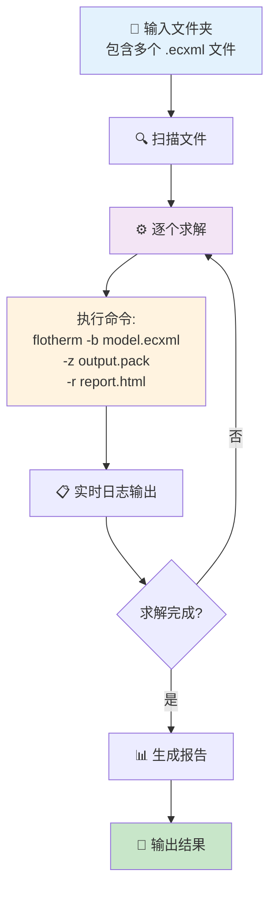

# FloTHERM 自动化工具

用于批量修改 ECXML/Pack 参数、自动求解和生成仿真案例的 Python 脚本。

**兼容 FloTHERM 2020.2**

---

## ⚠️ 实际测试结论

### 核心发现

经过实际测试，**FloTHERM 2020.2 的自动化能力**：

| 方式 | 可行性 | 说明 |
|-----|--------|------|
| **`-z` 参数求解** | ✅ **可行** | `flotherm -b model.ecxml -z output.pack` |
| 命令行无头模式 | ⚠️ 部分支持 | 只支持 `.prj` 和 `.floxml` 完全无头 |
| COM API | ❌ 不可用 | 2020.2 版本不支持 |
| Python API | ❌ 不可用 | 2020.2 版本不支持 |
| FloSCRIPT 宏 | ⚠️ 部分可用 | 需要打开 GUI，手动点击运行 |

### ✅ 推荐方案：`-z` 参数批量求解

**命令格式**：
```bash
flotherm -b model.ecxml -z output.pack
```

**说明**：
- `-b` 批处理模式
- `-z` 指定输出 PACK 文件
- 会打开 GUI 窗口，求解完成后自动关闭
- 结果保存到指定的 PACK 文件

**批量处理**：
```bash
python batch_ecxml_solver.py input_folder -o output_folder
```

### ⚠️ 备选方案：FloSCRIPT 宏 + 手动执行

如果 `-z` 参数不可用，可以使用 FloSCRIPT 宏：

**工作流程**：
1. 打开 FloTHERM GUI
2. 加载录制的 FloSCRIPT 宏
3. **手动点击运行按钮**
4. 宏自动执行：打开文件 → 求解 → 保存

**限制**：
- 必须打开 GUI
- 必须手动点击运行

---

## FloSCRIPT 宏使用方法

### 录制宏

1. 启动 FloTHERM GUI
2. 打开你的模型（.pack 或 .prj 文件）
3. 菜单 **Tools → Macro → Record...**
4. 执行你想要的操作：
   - Model → Reinitialize（重新初始化）
   - Model → Solve（求解）
   - File → Save As...（保存结果）
5. 菜单 **Tools → Macro → Stop Recording**
6. 保存宏文件（.xml）

### 运行宏

1. 打开 FloTHERM GUI
2. 菜单 **Tools → Macro → Play...**
3. 选择录制的宏文件
4. **点击运行**

### 宏文件示例

```xml
<?xml version="1.0" encoding="UTF-8"?>
<FloSCRIPT version="1.0">
    <Command name="Open" file="C:\path\to\model.pack"/>
    <Command name="Reinitialize"/>
    <Command name="Solve"/>
    <Command name="Save" file="C:\path\to\model_solved.pack"/>
</FloSCRIPT>
```

### 批量处理（半自动）

用 Python 脚本生成多个宏文件，然后逐个手动运行：

```bash
# 生成多个宏文件
python batch_pack_solver.py pack1.pack pack2.pack pack3.pack -o ./macros

# 然后在 GUI 中逐个手动运行每个宏
```

---

## 文件说明

| 文件 | 功能 | 状态 |
|-----|------|------|
| `excel_batch_simulation.py` | **⭐⭐ Excel 多配置批量仿真（推荐）** | ✅ 可用 |
| `batch_ecxml_solver.py` | **⭐ ECXML 批量求解器（使用 -z 参数）** | ✅ 可用 |
| `test_flotherm_api.py` | FloTHERM API 可用性测试脚本 | ✅ 可用 |
| `pack_editor.py` | Pack 文件编辑器（解压、查看、修改功耗） | ✅ 可用 |
| `ecxml_editor.py` | ECXML 文件解析和参数修改 | ✅ 可用 |
| `batch_simulation.py` | 批量仿真案例生成器 | ✅ 可用 |
| `batch_pack_solver.py` | 批量生成 FloSCRIPT 宏 | ⚠️ 需配合手动执行 |
| `flotherm_batch_solver.py` | 命令行批处理求解器 | ❌ 实际不可用 |

---

## 可用功能

### ⭐⭐ Excel 多配置批量仿真（推荐）

从 Excel 读取多个配置，自动修改 ECXML 模板并批量求解：

```bash
# 基本用法
python excel_batch_simulation.py template.ecxml config.xlsx -o ./output

# 指定 FloTHERM 路径
python excel_batch_simulation.py template.ecxml config.xlsx -o ./output --flotherm "C:\...\flotherm.exe"

# 仅生成 ECXML，不求解
python excel_batch_simulation.py template.ecxml config.xlsx -o ./output --no-solve

# 使用指定 sheet
python excel_batch_simulation.py template.ecxml config.xlsx -o ./output --sheet "配置1"

# 仅预览配置（不执行）
python excel_batch_simulation.py template.ecxml config.xlsx -o ./output --dry-run
```

#### Excel 格式

**简单格式（推荐）**：

| config_name | U1_CPU | U2_GPU | Ambient |
|-------------|--------|--------|---------|
| case1       | 10     | 5      | 25      |
| case2       | 15     | 8      | 35      |
| case3       | 20     | 10     | 40      |

- 第一列必须是 `config_name`（配置名称）
- 其他列名对应 ECXML 中的器件名或边界条件名
- 数值自动识别：功耗（W）或温度（°C）

#### 流程图


#### 输出目录结构

```
output/
└── batch_20260309_100000/
    ├── case1.ecxml          # 修改后的 ECXML
    ├── case1.pack           # 求解结果
    ├── case1_report.html    # 单个报告
    ├── case2.ecxml
    ├── case2.pack
    ├── case2_report.html
    ├── ...
    ├── batch_report.txt     # 批量求解报告
    └── summary.xlsx         # 配置+结果汇总
```

#### 依赖

```bash
pip install openpyxl  # 或
pip install pandas
```

---

### ⭐ 批量 ECXML 求解（推荐）

使用 `-z` 参数批量求解 ECXML 文件：

```bash
# 单文件求解
flotherm -b model.ecxml -z output.pack -r report.html

# 批量求解（Python 脚本）
python batch_ecxml_solver.py ./input_folder -o ./output_folder

# 指定 FloTHERM 路径
python batch_ecxml_solver.py ./input -o ./output --flotherm "C:\Program Files\Siemens\SimcenterFlotherm\2020.2\bin\flotherm.exe"

# 仅查看将要处理的文件（不执行）
python batch_ecxml_solver.py ./input -o ./output --dry-run
```

#### 流程图



**命令参数说明：**

| 参数 | 说明 |
|-----|------|
| `flotherm` | FloTHERM 可执行文件 |
| `-b` | 批处理模式 |
| `-z output.pack` | 指定输出 PACK 文件路径 |
| `-r report.html` | 指定输出 HTML 报告路径 |

#### 输出目录结构

```
output_folder/
└── batch_20260304_153045/          # 带时间戳的子文件夹
    ├── model1.pack                 # 求解结果
    ├── model1_report.html          # HTML 求解报告
    ├── model2.pack
    ├── model2_report.html
    ├── ...
    └── batch_report.txt            # 批量求解总结报告
```

#### 输出示例

```
============================================================
  [1/5] 正在求解: model1.ecxml
============================================================
  输入: ./input/model1.ecxml
  输出: ./output/batch_20260304_153045/model1.pack
  开始时间: 2026-03-04 15:30:45
  (命令行会等待求解完成，请勿关闭)

  ⠋ 求解中... 15秒
    📋 Solving iteration 150...
    📋 Convergence: 0.00123

  ✅ 求解完成!
     耗时: 125.3 秒
     文件大小: 15.23 MB
```

### 1. Pack 文件操作

```bash
# 列出 pack 文件内容
python pack_editor.py model.pack --list

# 解压 pack 文件
python pack_editor.py model.pack --extract ./extracted

# 提取 XML 文件
python pack_editor.py model.pack --to-ecxml output.xml

# 修改 pack 中的功耗
python pack_editor.py model.pack --set-power U1_CPU 15.0 -o modified.pack

# 批量修改功耗
python pack_editor.py model.pack --power-config power.json -o modified.pack
```

### 2. ECXML 文件操作

```bash
# 分析结构
python ecxml_editor.py model.ecxml --analyze

# 查看基本信息
python ecxml_editor.py model.ecxml --info

# 修改单个器件功耗
python ecxml_editor.py model.ecxml --set-power U1_CPU 15.0 -o modified.ecxml

# 批量修改（从配置文件）
python ecxml_editor.py model.ecxml --power-config power_config.json -o modified.ecxml

# 导出器件列表到 CSV
python ecxml_editor.py model.ecxml --export-csv components.csv
```

**power_config.json 格式**：
```json
{
    "U1_CPU": 15.0,
    "U2_GPU": 25.0,
    "U3_DDR": 5.0
}
```

### 3. 批量生成仿真案例

```bash
# CPU 功耗从 5W 到 25W，生成 5 个仿真案例
python batch_simulation.py template.ecxml \
    --component U1_CPU \
    --powers 5 10 15 20 25 \
    -o ./simulations
```

**注意**：生成的案例文件需要手动在 FloTHERM GUI 中打开并求解。

---

## FloXML 包装工具

有些官方 Excel 模板导出的不是完整项目 FloXML，而是 `geometry/assembly FloXML`。

典型现象：
- 文件里只有 `<attributes>` 和 `<geometry>`
- 直接按“项目 FloXML”导入会报 `Geometry file detected`

这时可以用：

```bash
python wrap_geometry_floxml_as_project.py input.xml -o output_project.xml
```

### 输入文件要求

这个脚本的 **输入必须满足**：

1. 必须是 `.xml`
2. 必须是 FloXML 文件，根节点要是 `<xml_case>`
3. 必须包含 `<geometry>`
4. 适合输入“几何级/装配级 FloXML”
5. **不能输入** Excel 文件，比如 `.xlsm/.xlsx`
6. **不能输入** 已经是完整项目的 FloXML

### 哪些文件可以输入

可以：
- `Advanced-Resistance.xlsm` 导出的 `.xml`
- `Windtunnel-AdvancedResistance.xlsm` 导出的 `.xml`
- 官方 `Assembly FloXML Examples/*.xml`

不可以：
- `Windtunnel-AdvancedResistance.xlsm` 这种 Excel 模板本身
- 已经带有 `<model>`、`<solve>`、`<grid>`、`<solution_domain>` 的 project FloXML

### 输出文件是什么

输出是一个最小可用的 **project FloXML**，脚本会：
- 保留原来的 `<attributes>`
- 保留原来的 `<geometry>`
- 自动补上 `<model>`
- 自动补上 `<solve>`
- 自动补上 `<grid>`
- 自动补上 `<solution_domain>`
- 如果缺少环境/流体定义，会自动补一个默认 `Ambient` 和 `Air`

### 示例

```bash
python wrap_geometry_floxml_as_project.py ^
  "D:\Program Files\Siemens\SimcenterFlotherm\2504\flotherm-automation\floxml_output\windtunnel_advres\PCB_ADV_RES.xml" ^
  -o "D:\Program Files\Siemens\SimcenterFlotherm\2504\flotherm-automation\floxml_output\windtunnel_advres\PCB_ADV_RES_project.xml"
```

---

## 总结

**FloTHERM 2020.2 自动化现状**：

- ✅ **`-z` 参数求解 ECXML**：`flotherm -b model.ecxml -z output.pack`
- ⚠️ 会打开 GUI，但求解完成后自动关闭
- ✅ 可以用 Python 脚本批量处理
- ❌ COM/Python API 不可用
- ⚠️ FloSCRIPT 宏可用，但需要手动点击运行

**推荐工作流**：
1. 用 `batch_ecxml_solver.py` 批量求解 ECXML 文件
2. 或者用 Python 脚本修改参数后批量求解
3. 升级到更新版本可能支持更好的自动化
